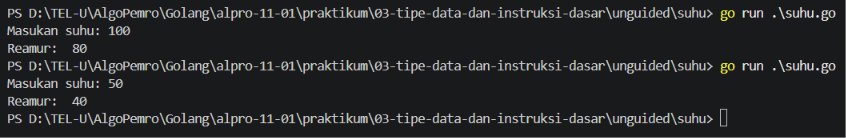
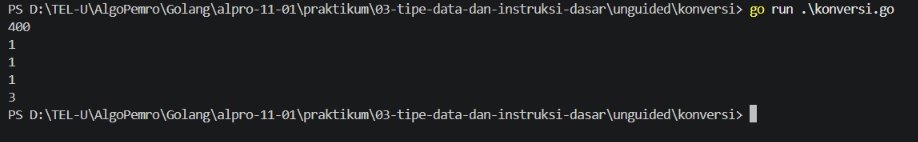

# <h1 align="center">Laporan Praktikum Modul 3 - Variabel dan Operator</h1>
<p align="center">Firas Abdurrahman Sandro - 109092600009</p>

## Dasar Teori

### A. Variabel
Variabel adalah tempat kita untuk menaruh atau menyimpan data dan mengaksesnya dimanapun kita mau. Variabel dalam Bahasa Go hanya bisa menyimpan satu jenis tipe data sama dan jika ingin menyimpan lebih dari satu tipe data, harus membuat lebih dari satu variabel.

#### 1. Deklarasi Variabel
Untuk mendeklarasikan variable, kita bisa menggunakan kata kunci `var` lalu diikuti dengan nama variabel dan tipe datanya, seperti contoh:

```go
var nama string
```
Kita juga bisa menulis tanpa tipe datanya dengan menggunakan `=`, dengan syarat harus diisi nilai variabelnya, seperti contoh:

```go
var nama = "Firas Abdurrahman Sandro"
```
Program akan otomatis membaca tipe datanya seperti di atas, jadi tidak perlu menuliskan tipe datanya secara eksplisit.

Kitas juga bisa menulis variabel tanpa `var` dengan menggunakan `:=` dan langsung menulis nilai variabelnya, seperti contoh:

```go
nama := "Firas Abdurrahman Sandro"
```
Jika sudah menggunakan `:=`, kita tidak boleh menggunakan `:=` lagi saat memanggil variabel tersebut, kita bisa menggunakan `=` untuk memanggil variabel tersebut, seperti contoh:

```go
nama := "Firas Abdurrahman Sandro"
nama = "Ayoyoyo"
```

#### 2. Mengakses Variabel
Varibel kita bisa memanggilnya berkali kali, Di Golang variabel tidak boleh tidak digunakan, jadi saat kita mendeklarasikan kita harus menggunakan variabel tersebut. Kita bisa memanggil variabel dengan menggunakan `=`, seperti contoh:

```go
package main

import "fmt"

func main() {
    var name string
    name = "Firas Abdurrahman Sando"
    fmt.Println(name)
}
```

#### 3. Mulpiple Variabel
Kita juga bisa memanggil beberapa variabel secara bersamaan, seperti contoh:

```go
package main

import "fmt"

func main() {
    var (
        firstName = "Firas"
        lastName  = "Abdurrahman Sandro"
    )
    fmt.Println(firstName, lastName)
}
```

### B. Operator
Operator adalah operasi untuk melakukan manipulasi data, seperti penjumlahan, pengurangan, perkalian, pembagian, dan sebagainya. 

Secara umum terdapat tiga kategori operator, yaitu:
#### 1. Operator Aritmatika
Operator aritmatika adalah operator yang digunakan untuk melakukan operasi matematika, seperti penjumlahan, pengurangan, perkalian, pembagian, dan sebagainya. berikut adalah list operator aritmatika:
- `+`: Penjumlahan
- `-`: Pengurangan
- `*`: Perkalian
- `/`: Pembagian
- `%`: Modulo/sisa bagi

#### 2. Operator Perbandingan
Operator perbandingan adalah operator yang digunakan untuk melakukan operasi perbandingan, seperti lebih besar, lebih kecil, sama dengan, dan sebagainya. berikut adalah list operator perbandingan:
- `==`: Sama dengan
- `!=`: Tidak sama dengan
- `<`: Lebih kecil
- `>`: Lebih besar
- `<=`: Lebih kecil atau sama dengan
- `>=`: Lebih besar atau sama dengan

#### 3. Operator Logika
Operator logika adalah operator yang digunakan untuk melakukan operasi logika, seperti AND, OR, dan NOT. berikut adalah list operator logika:
- `&&`: AND
- `||`: OR
- `!`: NOT 


<!-- Tambahkan poin A, B, C, ... atau sub-topik 1, 2, 3, ... sesuai kebutuhan modul -->

## Guided

### 1. konversi.go

```go
package main

import "fmt"

func main() {
	var celcius float64

	fmt.Print("Masukan suhu: ")
	fmt.Scan(&celcius)

	k := celcius + 273

	fmt.Println("Kelvin: ", k)
}
```
#### Deskripsi
Program konversi suhu dari celcius ke kelvin, yang membutuhkan input suhu dalam celcius. Data yang disimpan dengan bilangan real atau `float64`. Input suhu dalam celcius lalu program akan melakukan perhitungan konversi ke kelvin dengan rumus `K = C + 273`, kemudian akan menampilkan hasil konversi ke layar.
###### Input
    Masukan suhu: 25
###### Output
    Kelvin:  298

### 2. tukar.go

```go
package main

import "fmt"

func main() {
	var y, x, z int

	fmt.Print("Masukan nilai x: ")
	fmt.Scan(&x)
	fmt.Print("Masukan nilai y: ")
	fmt.Scan(&y)
	fmt.Print("Masukan nilai z: ")
	fmt.Scan(&z)

	// x, y, z = z, x, y
	temp := x
	x = y
	y = z
	z = temp

	fmt.Println(x," ",y," ",z)
}

```
#### Deskripsi
Program untuk menukarkan nilai bilangan bulat x, y, z ke z, x, y. Menggukan variabel temp untuk menyimpan nilai x sebelum diubah. Program akan menampilkan hasil menukarkan nilai bilangan bulat tersebut. Dengan inputan x, y, z dan keluaran x, y, z yang terlah diturkar nilainya.
###### Input
	Masukan nilai x: 1
	Masukan nilai y: 2
	Masukan nilai z: 3
###### Output
	3 1 2

### 3. kasir.go

```go
package main

import "fmt"

func main() {
	var x int
	
	fmt.Print("Masukan Uang: ")
	fmt.Scan(&x)

	lembarSepuluh := x / 10000
	sisaSepuluh := x % 10000
	lembarLima := sisaSepuluh / 5000
	sisaLima := sisaSepuluh % 5000
	lembarSeribu := sisaLima / 1000

	fmt.Println(lembarSepuluh, " ", lembarLima, " ", lembarSeribu)
}
```
#### Deskripsi
Program untuk menghitung jumlah lembar uang 10000, 5000, dan 1000 untuk uang kembalian. Program akan menampilkan hasil jumlah lembar uang tersebut. Dengan menggunakan operator pembagian `(/)` dan modulus `(%)`. Pembagian untuk menghitung jumlah lembar uang dan modulus untuk menghitung sisa pembagian.
###### Input
	Masukan Uang: 19000
###### Output
	1 1 4

<!-- Tambahkan blok file/kode lain sesuai jumlah file pada soal guided -->

## Unguided

### 1. suhu.go

```go
package main

import "fmt"

func main() {
	var celcius float64

	fmt.Print("Masukan suhu: ")
	fmt.Scan(&celcius)

	r := 4.0 / 5.0 * celcius
	fmt.Println("Reamur: ", r)
}

```

##### Output
<!-- Path relatif dari readme.md ke folder unguided/[nama_soal]/output.png, contoh: -->



#### Deskripsi
Program untuk mengkonversi suhu dari celcius ke reamur. Celcius disimpan dengan tipe data real atau `float64`. Input suhu dalam celcius lalu program akan melakukan perhitungan konversi ke reamur dengan rumus `R = 4/5 * C`, kemudian akan menampilkan hasil konversi dalam bentuk reamur.

### 2. konversi.go

```go
package main

import "fmt"

func main () {
	var hari int

	fmt.Scan(&hari)
	tahun := hari / 360
	sisaTahun := hari % 360
	bulan := sisaTahun / 30
	sisaBulan := sisaTahun % 30
	minggu := sisaBulan / 7
	hari = sisaBulan % 7
	fmt.Println(tahun)
	fmt.Println(bulan)
	fmt.Println(minggu)
	fmt.Println(hari)
}
```

##### Output


#### Deskripsi
Program untuk mengkonversi hari ke dalam satuan tahun, bulan, minggu, dan hari. Inputan hari disimpan dalam billangan bulat `int`. Mengikuti aturan dunia, 1 minggu di baca 7 hari, 1 bulan di baca 30 hari, dan 1 tahun di baca 12 bulan atau 360 hari. Program akan menampilkan hasil konversi dalam satuan tahun, bulan, minggu, dan hari.

<!-- Duplikasi blok "### [nama_soal]" sesuai jumlah folder soal di dalam unguided -->


## Kesimpulan
Tujuan pada praktikum kali ini adalah belajar menggunakan dan mengimplementasikan variabel dan operator ke dalam suatu program. Kita belajar berbagai macam penulisan variable, mulai dari menggunakan `var` sampai menggunakan `:=`, kita juga belajar menggunakan berbagai macam operasi mulai dari aritmatika seperti `+`, `-`, `*`, `/`, `=` sampai konversi tipe data.

## Referensi
1. BuildWithAngga. (2023). Dasar-Dasar Bahasa Pemrograman Go: Variabel, Tipe Data, dan Operasi Dasar. BuildWithAngga Tips. Diakses pada 4 Oktober 2026 melalui https://buildwithangga.com/tips/dasar-dasar-bahasa-pemrograman-go-variabel-tipe-data-dan-operasi-dasar
2. DumbWays ID. (2023). Cara Kerja dengan Variabel Go. DumbWays Blog. Diakses pada 4 Oktober 2026 melalui https://dumbways.id/blog/cara-kerja-dengan-variabel-go
3. Isna, Annisa. (2021). Golang: Variable, Constant & Konversi Data. Medium. Diakses pada 4 Oktober 2026 melalui https://medium.com/@annisaisna/golang-variable-constant-konversi-data-cffa6eb44704
4. Maulayya, Fika Ridaul. (2025). Belajar Golang Dasar #6: Operator. SantriKoding. Diakses pada 4 Oktober 2026 melalui https://santrikoding.com/belajar-golang-dasar-6-operator
5. Novalagung. (2018). Golang Operator. Dasar Pemrograman Golang. Diakses pada 4 Oktober 2026 melalui https://dasarpemrogramangolang.novalagung.com/A-operator.html
6. Novalagung. (2018). Variabel. Dasar Pemrograman Golang. Diakses pada 4 Oktober 2026 melalui http://dasarpemrogramangolang.novalagung.com/A-variabel.html
7. Ruang Developer. (2022). Variable - Belajar Golang Dari Dasar. Diakses pada 4 Oktober 2026 melalui https://blog.ruangdeveloper.com/golang-variable/
8. W3Schools. (2026). Go Variables. W3Schools Go Tutorial. Diakses pada 4 Oktober 2026 melalui https://www.w3schools.com/go/go_variables.php
<!-- Tambahkan nomor referensi berikutnya sesuai kebutuhan -->
