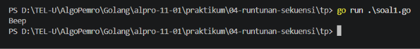
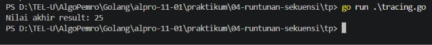
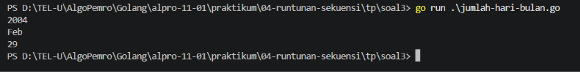
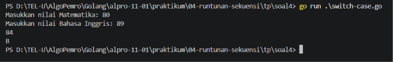

# <h1 align="center">Tugas Pendahuluan Modul 04 - Runtutan Sekuensi</h1>
<p align="center">Firas Abdurrahman Sandro - 109092600009</p>

### 1. soal1.go

```go
package main

import "fmt"

func main() {
	intNum := 5
	intOther := 10
	var sngNum float64 = -3

	if intOther + 2 * intNum != 30 || !(sngNum > 0){
		fmt.Println("Beep")
    }
}
```

##### Output
<!-- Path relatif dari readme.md ke folder unguided/[nama_soal]/output.png, contoh: -->



#### Deskripsi
Tugas pengecekan setiap ekspresi kontrol yang terdaftar menghasilkan true atau false yang di gunakan pada pernyataan if berikut:
```go
intNum := 5
intOther := 10
var sngNum float64 = -3

if _____________ {
    fmt.Println("Beep")
}
```
Di atas hanya mencontohkan salah satu konsidi, berikut ke-14 kondisi yang terdaftar berserta hasil true atau false:
1. intNum > 5  
   - False

2. intNum >= 5 && intOther < 11  
   - True

3. sngNum != -1 || intOther < 0  
   - True

4. !(intNum > 3) || intNum <= 5  
   - True

5. !(intOther >= intNum)  
   - False

6. 0 - sngNum > 0  
   - True

7. 4 / 2 == intOther / intNum  
   - True

8. intOther % 2 == 0  
   - True

9. intOther + 2 * intNum != 30 || !(sngNum > 0)  
   - True

10. intOther > 0 && intNum > 0 || sngNum > 0  
    - True

11. sngNum > 0 || (intNum >= 0 && -1 * intOther == -10)  
    - True

12. intNum == 5  
    - True

13. intNum > 0 || (sngNum <= 0 && intOther == 13)  
    - True

14. !(!(!(!(intNum > 0))))  
    - True

### 2. tracing.go

```go
package main

import "fmt"

func main() {
	x := 10
	y := 5
	z := 15
	result := 0

	if x > 5 {
		if y < 10 {
			result = x + y
		} else {
			result = x - y
		}
	}

	if z > 10 && x == 10 {
		result += z
	} else {
		result = z - x
	}

	if x == 10 || y > 10 {
		result += 5
	} else if y == 5 && z > 10 {
		result -= 5
	} else {
		result *= 2
	}

	if !(x < 15 && y < 10) {
		result += 10
	} else {
		result -= 10
	}

	fmt.Println("Nilai akhir result:", result)
}
```

##### Output
<!-- Path relatif dari readme.md ke folder unguided/[nama_soal]/output.png, contoh: -->



#### Deskripsi
Soal 2 bertujuan untuk melacak alur eksekusi program dan menentukan nilai akhir setiap variable. Dari tugas ini, terdapat 3 pertanyaan terkait soal ini:

##### Soal
1. Berapa nilai akhir dari variabel result setelah semua pernyataan kondisi dieksekusi?
2. Apa output yang dihasilkan oleh program?
3. Tuliskan langkah-langkah alur eksekusi program berdasarkan kondisi yang diberikan:
    - Kondisi 1: Apakah kondisi x > 5 benar? Jika ya, apa yang terjadi selanjutnya?
    - Kondisi 2: Apakah kondisi z > 10 && x == 10 benar? Bagaimana hal ini memengaruhi nilai result?
    - Kondisi 3: Apakah salah satu dari kondisi x == 10 || y > 10 benar? Apa yang terjadi?
    - Kondisi 4: Bagaimana kondisi !(x < 15 && y < 10) dievaluasi? Apa dampaknya pada result?

##### Jawaban
1. 25
2. Output: Nilai akhir result: 25
3. Langkah-langkah alur eksekusi program:
    - Kondisi 1: True, result = 10 + 5 = 15
    - Kondisi 2: True, result = result(15, dari kondisi sebelumnya) + 15 = 30
    - Kondisi 3: True, result = result(30, dari kondisi sebelumnya) + 5 = 35
    - Kondisi 4: False, result = result(35, dari kondisi sebelumnya) - 10 = 25


### 3. jumlah-hari-bulan.go

```go
package main

import "fmt"

func main() {
	var tahun int
	var bulan string
	var tahunKabisat bool

	fmt.Scanln(&tahun)
	fmt.Scanln(&bulan)
	tahunKabisat = tahun%4 == 0 && (tahun%100 != 0 || tahun%400 == 0)

	if bulan == "Jan" || bulan == "Mar" || bulan == "Mei" || bulan == "Jul" || bulan == "Agu" || bulan == "Okt" || bulan == "Des" {
		fmt.Println(31)
	} else if bulan == "Apr" || bulan == "Jun" || bulan == "Sep" || bulan == "Nov" {
		fmt.Println(30)
	} else if bulan == "Feb" {
		if tahunKabisat {
			fmt.Println(29)
		} else {
			fmt.Println(28)
		}
	} else {
		fmt.Println("-")
	}
}
```

##### Output
<!-- Path relatif dari readme.md ke folder unguided/[nama_soal]/output.png, contoh: -->



#### Deskripsi
Membuat program yang meminta input tahun dan 3 huruf pertama dari nama bulan (huruf pertama kapital). Program akan menampilan jumlah hari dari bulan tersebut, dan jika input tidak sesuai, program akan menampilkan "-".
Nama bulan yang diperbolehkan adalah `"Jan"`, `"Feb"`, `"Mar"`, `"Apr"`, `"Mei"`, `"Jun"`, `"Jul"`, `"Agu"`, `"Sep"`, `"Okt"`, `"Nov"`, `"Des"`. Dan pertimbangkan tahun kabisat yang dimana Februari hanya memiliki 29 hari.

Program menggunakan `if` untuk memeriksa kondisi bulan dan tahun. Untuk mengecek tahun kabisat, menggukan rumus `tahun%4 == 0 && (tahun%100 != 0 || tahun%400 == 0)`.


### 4. Switch Case

```go
package main

import "fmt"

func main() {
	var nilaiMtk, nilaiBhsIng int

	fmt.Print("Masukkan nilai Matematika: ")
	fmt.Scan(&nilaiMtk)
	fmt.Print("Masukkan nilai Bahasa Inggris: ")
	fmt.Scan(&nilaiBhsIng)
	rataRata := (nilaiMtk + nilaiBhsIng) / 2
	fmt.Println(rataRata)

	switch {
		case rataRata >= 90:
			fmt.Println("A")
		case rataRata >= 80:
			fmt.Println("B")
		case rataRata >= 70:
			fmt.Println("C")
		default:
			fmt.Println("D")
	}
}
```

##### Output
<!-- Path relatif dari readme.md ke folder unguided/[nama_soal]/output.png, contoh: -->



#### Deskripsi
Mencoba untuk membuat 1 program Bahasa Go yang menerapkan switch case. Saya membuat program untuk menentukan grade dari rata-rata nilai matematika dan bahasa inggris. Program menggunakan switch case untuk menentukan grade berdasarkan nilai rata-rata.

Program menggunakan `switch` untuk menentukan grade berdasarkan nilai rata-rata. Dalam switch case, saya menggunakan `case` untuk menentukan kondisi yang sesuai dan menampilkan grade yang sesuai.

## Kesimpulan
Pada praktikum ini, saya telah mempelajari tentang penggunaan `if` dan `switch` untuk membuat program yang menentukan kondisi dan menampilkan hasil yang sesuai.